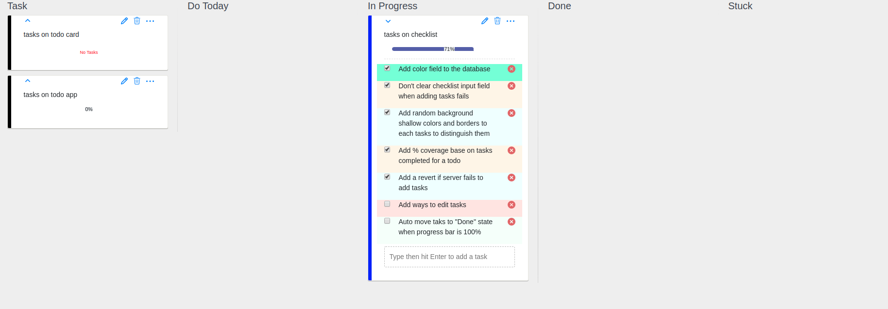

# Todo Planner

Are you obsessed about tasks planning and want to do things on time? but you don't have the means to pay for one? Then, **Todo Planner** is your tool.

This is a tool that helps you plan your tasks easily. You can keep track of your tasks with the various states
- **Tasks**: All tasks to be done but not yet started working on.
- **Do Today**: Tasks to be completed today
- **In Progress**: Tasks currently working on
- **Done**: Tasks already completed
- **Stuck**: Tasks that couldn't be finished due to some issues.

Also, if you are a developer, you can customize it to your liking. 


## Installation
This section will walk you through the installation process. You will be able to setup this tool on your personal computer and start using it to boost your productivity.
### Fork and Clone
Fork this repo, then clone with 
```
git clone https://github.com/Eyongkevin/Todo-App---PERN-Stack.git
```

### Setup Database
This app uses [postgreSQL](https://www.postgresql.org/) to store tasks. Make sure you have it installed on your computer.

Open a terminal in the `./server` directory and follow these steps.
#### Create a postgres user
```
# connect to the default postgres database as the server's root user
$ psql -U postgres 

# create 'todo_user' with password 'todo'. This is default, but you can change it.
# If you change, make sure to edit the './sever/db.js' file with new credentials
$ CREATE USER todo_user WITH PASSWORD todo;
$ ALTER USER todo_user WITH CREATEDB;
$ \q
```
#### Create the database with your new user.
```
# Now use the new user to create a new database
$ psql -d postgres -U todo_user
$ CREATE DATABASE perntodo;
$ \q

# Connect to new database with new user and create the tables from the `database.sql` file
$ psql -d perntodo -U todo_user
$ \i ./database.sql
```

### Run the Server
The server is build with Express.js. First, install the dependencies. Open a terminal in the `./server` directory and run the command 
```
$ npm install
```
Start the server
```
$ npm start
```
The server will start at http://localhost:5000/
### Run the Client
The client is build with React.js. First, install the dependencies. Open a terminal in the `./client` directory and run the command
```
$ npm install
```
Start the client 
```
$ npm start
```
The client will start at http://localhost:3000/


## How to Contribute
**Todo Planner** is an [open source](https://opensource.com/resources/what-open-source) project. I am open to suggestions and willing into extend it to a different level. Enyone willing to contribute is highly welcomed. To contribute, go ahead and:

- Fork it!
- Create your feature branch: `git checkout -b my-new-feature`
- Commit your changes: `git commit -am 'Add some feature'`
- Push to the branch: `git push origin my-new-feature`
- Submit a pull request

## Coming Soon
This tool is still under development. So far, this is the interface we have

